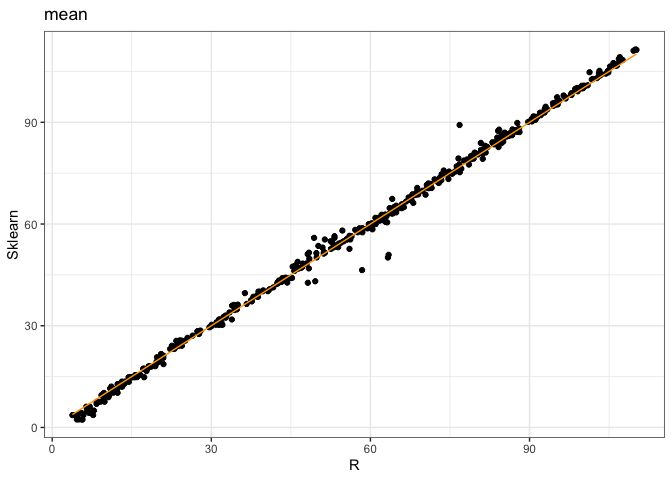
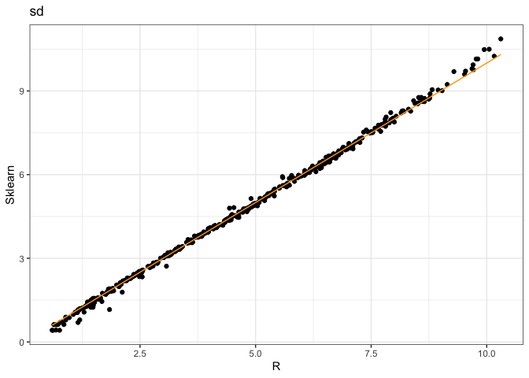
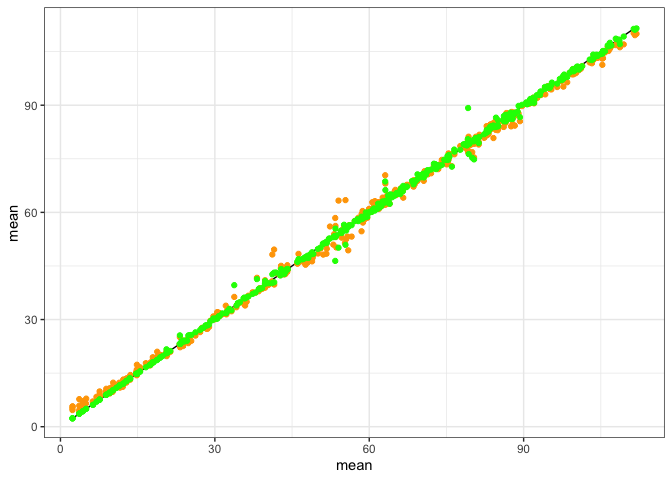
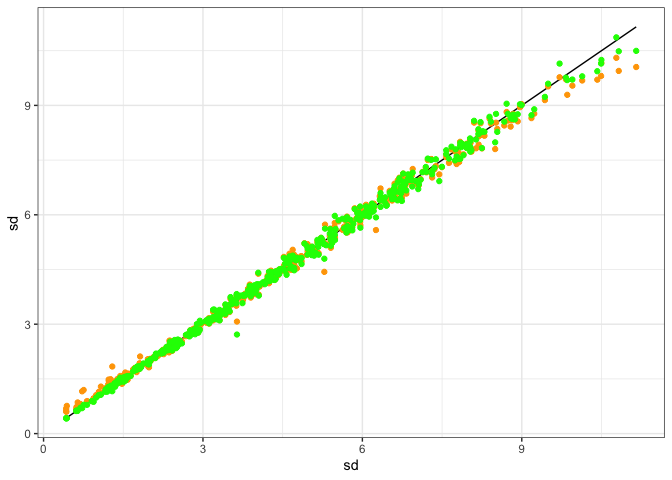

Report
================

``` r
library(dplyr)
```


    Attaching package: 'dplyr'

    The following objects are masked from 'package:stats':

        filter, lag

    The following objects are masked from 'package:base':

        intersect, setdiff, setequal, union

``` r
library(ggplot2)
theme_set(theme_bw())

true_vals <- read.csv(here::here("data", "true_fs_pars_test.csv")) %>%
  select(richness, abundance, mean, sd)
r_predictions <- read.csv(here::here("data", "r_rf_predicted_pars.csv"))
sklearn_predictions <- read.csv(here::here("data", "rf_predicted_pars.csv"))

bound_predictions <- left_join(r_predictions, sklearn_predictions, by = c("richness", "abundance")) %>%
  left_join(true_vals)
```

    Joining, by = c("richness", "abundance")

## Comparing R to sklearn

``` r
ggplot(bound_predictions, aes(rf_mean.x, rf_mean.y)) +
  geom_point() +
  geom_line(aes(y = rf_mean.x), color = "orange") +
  xlab("R") +
  ylab("Sklearn") +
  ggtitle("mean")
```



``` r
ggplot(bound_predictions, aes(rf_sd.x, rf_sd.y)) +
  geom_point() +
  geom_line(aes(y = rf_sd.x), color = "orange") +
  xlab("R") +
  ylab("Sklearn") +
  ggtitle("sd")
```



## Comparing R to sklearn to true

``` r
ggplot(bound_predictions, aes(mean, mean)) +
  geom_line() +
  geom_point(aes(y = rf_mean.x), color = "orange") +
  geom_point(aes(y = rf_mean.y), color = "green")
```



``` r
ggplot(bound_predictions, aes(sd, sd)) +
  geom_line() +
  geom_point(aes(y = rf_sd.x), color = "orange") +
  geom_point(aes(y = rf_sd.y), color = "green")
```


