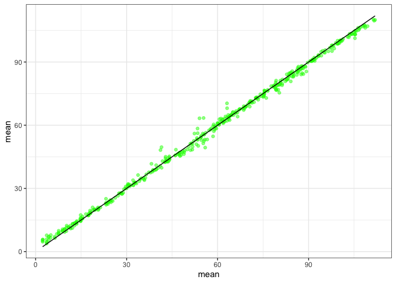
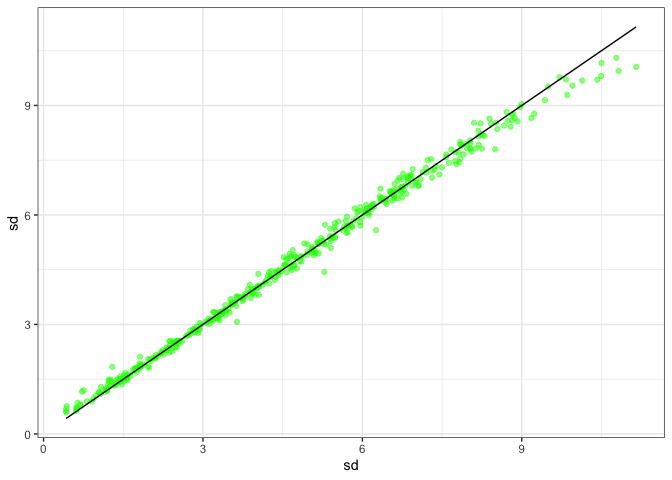

# Report

``` r
library(dplyr)
```


    Attaching package: 'dplyr'

    The following objects are masked from 'package:stats':

        filter, lag

    The following objects are masked from 'package:base':

        intersect, setdiff, setequal, union

``` r
library(ggplot2)
theme_set(theme_bw())

true_vals <- read.csv(here::here("accessory_data", "true_fs_pars_test.csv")) %>%
  select(richness, abundance, mean, sd)
r_predictions <- read.csv(here::here("accessory_data", "r_rf_predicted_pars.csv"))

bound_predictions <- left_join(r_predictions, true_vals)
```

    Joining with `by = join_by(richness, abundance)`

## Comparing random forest predictions to true

``` r
ggplot(bound_predictions, aes(mean, mean)) +
  geom_point(aes(y = rf_mean), color = "green", alpha = .5) +
    geom_line() 
```



``` r
ggplot(bound_predictions, aes(sd, sd)) +
  geom_point(aes(y = rf_sd), color = "green", alpha = .5) +
    geom_line() 
```


