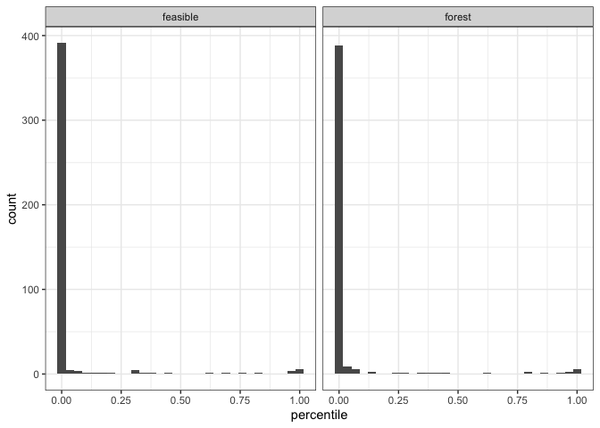
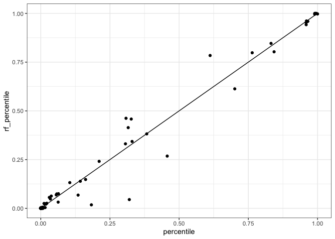
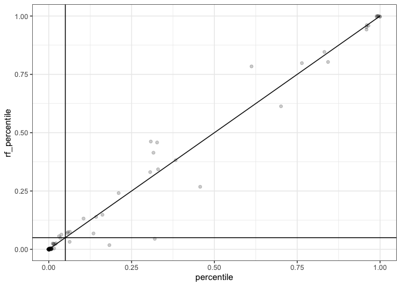
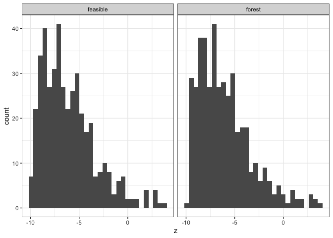
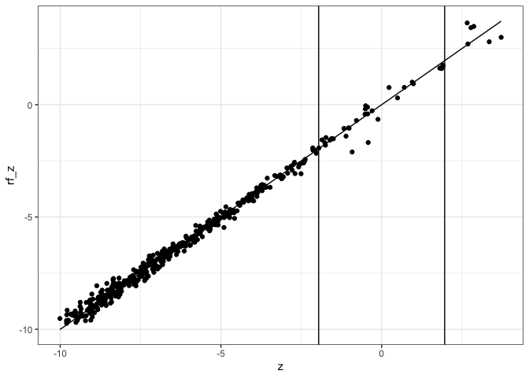

Report
================

``` r
library(dplyr)
```


    Attaching package: 'dplyr'

    The following objects are masked from 'package:stats':

        filter, lag

    The following objects are masked from 'package:base':

        intersect, setdiff, setequal, union

``` r
library(ggplot2)
theme_set(theme_bw())

ls_to_fs_norm <- read.csv(here::here("data", "ls_to_fs_norm.csv"))
ls_to_fs_draws <- read.csv(here::here("data", "ls_to_fs_draws.csv"))


ls_to_rf_norm <- read.csv(here::here("data", "ls_to_rf_norm.csv"))
ls_to_rf_draws <- read.csv(here::here("data", "ls_to_rf_draws.csv"))
```

## Percentiles

``` r
draws <- ls_to_fs_draws %>%
  mutate(source = "feasible") %>%
  bind_rows(mutate(ls_to_rf_draws, source = "forest"))


ggplot(draws, aes(percentile)) +
  geom_histogram() +
  facet_wrap(vars(source))
```

    `stat_bin()` using `bins = 30`. Pick better value with `binwidth`.

    Warning: Removed 20 rows containing non-finite values (stat_bin).



``` r
draws %>%
  group_by(source) %>%
  summarize(n_below_pt5 = mean(percentile < .05, na.rm = T))
```

    # A tibble: 2 × 2
      source   n_below_pt5
      <chr>          <dbl>
    1 feasible       0.923
    2 forest         0.925

``` r
draws2 <- ls_to_fs_draws %>%
  select(-X) %>%
  left_join(rename(ls_to_rf_draws, rf_percentile = percentile), by = c("richness", "abundance", "hill1"))

ggplot(draws2, aes(percentile, rf_percentile)) +
  geom_point() +
  geom_line(aes(y = percentile))
```

    Warning: Removed 10 rows containing missing values (geom_point).

    Warning: Removed 10 row(s) containing missing values (geom_path).



``` r
ggplot(draws2, aes(percentile, rf_percentile)) +
  geom_point() +
  geom_line(aes(y = percentile)) +
  geom_vline(xintercept = .05) +
  geom_hline(yintercept = .05)
```

    Warning: Removed 10 rows containing missing values (geom_point).
    Removed 10 row(s) containing missing values (geom_path).



## Normals

``` r
norms <- ls_to_fs_norm %>%
  mutate(source = "feasible") %>%
  bind_rows(mutate(ls_to_rf_norm, source = "forest"))


ggplot(norms, aes(z)) +
  geom_histogram() +
  facet_wrap(vars(source))
```

    `stat_bin()` using `bins = 30`. Pick better value with `binwidth`.

    Warning: Removed 20 rows containing non-finite values (stat_bin).



``` r
norms %>%
  group_by(source) %>%
  summarize(n_below_pt5 = mean(abs(z) > 1.96, na.rm = T))
```

    # A tibble: 2 × 2
      source   n_below_pt5
      <chr>          <dbl>
    1 feasible       0.928
    2 forest         0.928

``` r
norms2 <- ls_to_fs_norm %>%
  select(-X) %>%
  left_join(rename(ls_to_rf_norm, rf_z = z, rf_p = p), by = c("richness", "abundance", "hill1"))

ggplot(norms2, aes(z, rf_z)) +
  geom_point() +
  geom_line(aes(y = z))
```

    Warning: Removed 10 rows containing missing values (geom_point).

    Warning: Removed 10 row(s) containing missing values (geom_path).



``` r
ggplot(norms2, aes(p, rf_p)) +
  geom_point(alpha = .2) +
  geom_line(aes(y = p))+
  geom_vline(xintercept = .05) +
  geom_hline(yintercept = .05)
```

    Warning: Removed 10 rows containing missing values (geom_point).
    Removed 10 row(s) containing missing values (geom_path).


