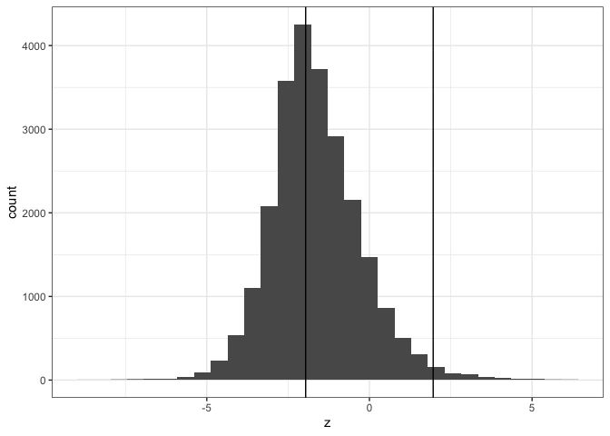
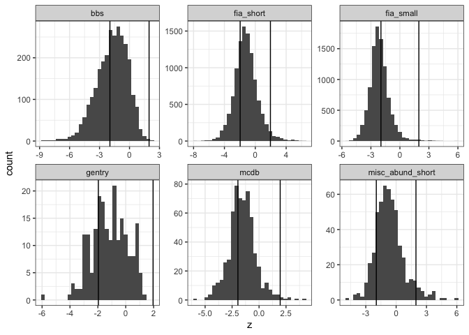
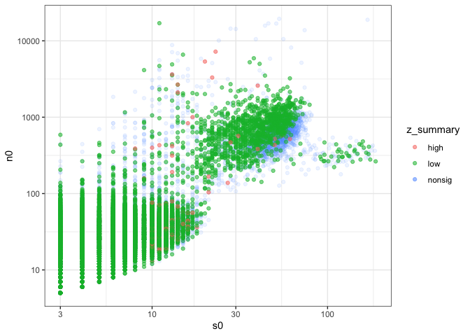

all_di
================

``` r
library(dplyr)
```


    Attaching package: 'dplyr'

    The following objects are masked from 'package:stats':

        filter, lag

    The following objects are masked from 'package:base':

        intersect, setdiff, setequal, union

``` r
library(ggplot2)
library(feasibleforest)

theme_set(theme_bw())
```

``` r
all_di <- read.csv(here::here("scripts", "filtered_di_hill.csv"))

all_di_real <- all_di %>%
  filter(!singletons)
```

``` r
all_di_real$z <- NA


for(i in 1:nrow(all_di_real)) {
  
  all_di_real$z[i] <- obs_to_forest_z(all_di$hill1[i],
                                      all_di$s0[i],
                                      all_di$n0[i])
  
}
```

``` r
all_di_real <- all_di_real %>%
  mutate(z_summary = case_when(
    z > 1.96 ~ "high",
    z < -1.96 ~ "low",
    TRUE ~ "nonsig"
  ))
```

``` r
ggplot(all_di_real, aes(x = z)) +
  geom_histogram() +
  geom_vline(xintercept = -1.96) +
  geom_vline(xintercept = 1.96)
```

    `stat_bin()` using `bins = 30`. Pick better value with `binwidth`.



``` r
mean(all_di_real$z < -1.96)
```

    [1] 0.4357063

``` r
mean(all_di_real$z > 1.96)
```

    [1] 0.01428748

**43% of the sites, overall, are LOW hill1 relative to the (predicted)
feasible set 1.5% are HIGH.**

``` r
ggplot(all_di_real, aes(x = z)) +
  geom_histogram() +
  geom_vline(xintercept = -1.96) +
  geom_vline(xintercept = 1.96) +
  facet_wrap(vars(dat), scales = "free")
```

    `stat_bin()` using `bins = 30`. Pick better value with `binwidth`.



``` r
ggplot(all_di_real, aes(s0, n0, color = z_summary)) +
  geom_point(alpha = .1) +
  geom_point(data = all_di_real %>% filter(z_summary != "nonsig"), alpha = .5) +
  scale_x_log10() +
  scale_y_log10()
```



``` r
all_di_real %>%
  group_by(dat, z_summary) %>%
  summarize(n = dplyr::n()) %>%
  group_by(dat) %>%
  mutate(totaln = sum(n)) %>%
  mutate(prop = n / totaln)
```

    `summarise()` has grouped output by 'dat'. You can override using the `.groups`
    argument.

    # A tibble: 17 × 5
    # Groups:   dat [6]
       dat              z_summary     n totaln    prop
       <chr>            <chr>     <int>  <int>   <dbl>
     1 bbs              high          4   2773 0.00144
     2 bbs              low        1125   2773 0.406  
     3 bbs              nonsig     1644   2773 0.593  
     4 fia_short        high        268  10354 0.0259 
     5 fia_short        low        3066  10354 0.296  
     6 fia_short        nonsig     7020  10354 0.678  
     7 fia_small        high         43   9825 0.00438
     8 fia_small        low        6030   9825 0.614  
     9 fia_small        nonsig     3752   9825 0.382  
    10 gentry           low          60    207 0.290  
    11 gentry           nonsig      147    207 0.710  
    12 mcdb             high          7    605 0.0116 
    13 mcdb             low         226    605 0.374  
    14 mcdb             nonsig      372    605 0.615  
    15 misc_abund_short high         25    523 0.0478 
    16 misc_abund_short low          75    523 0.143  
    17 misc_abund_short nonsig      423    523 0.809  
